以太坊是当前除了比特币以外，最知名的公链，其生态极其丰富，被称为区块链2.0的代表。

那么，对于这样一个公链，我们除了阅读其白皮书、黄皮书外，还有哪些了解其的方式呢？

这里，我就为大家介绍一下 etherscan 这款工具，etherscan 是以太坊官方支持的区块链浏览器。通过它，我们不但可以查询以太坊本身的一些数据，还可以查看所有基于以太坊发行的代币的转移路线、持有者、交易量和合同等。

因此，对于以太坊爱好者来讲，etherscan 是一款必备的查询工具，同时也是小白了解以太坊的入门途径之一。

etherscan网址：https://cn.etherscan.com

## 查看以太坊网络

进入到 etherscan 后，首页显示的就是我们当前的以太坊网络的概览，通过这些数据我们可以了解到当前以太坊网络的大致运行情况。

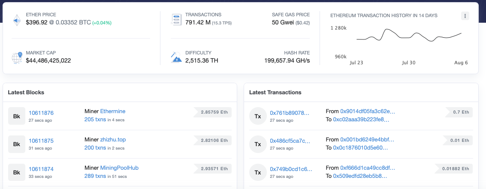

ETHER PRICE 是当前以太坊的价格，目前是396.92美元，后面的0.03352 BTC 则代表的是当前一个以太可以兑换成多少比特币。

TRANSACTIONS 指的是全网一共产生的交易笔数，15.3 TPS 则代表目前以太坊网络每秒可以处理15.3笔交易，SAFE GAS PRICE是目前以太坊网络的转账手续费。

MARKET CAP 是指目前以太坊的总市值，DIFFICULTY 则是目前的平均挖矿难度。当然，随着后续 eth2.0 的到来，POW 挖矿将会变迁为 POS 挖矿，届时挖矿难度就不再存在了。

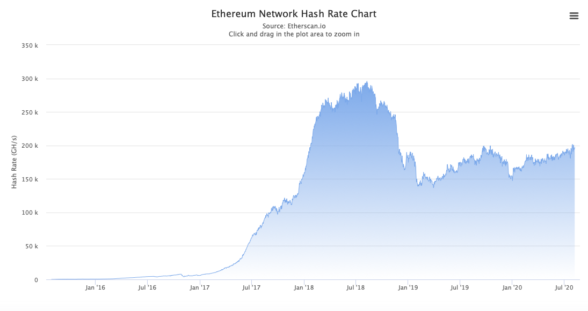

MARKET CAP 旁边的 HASH RATE 指的则是全网算力，点开它，我们还可以看到以太坊网络全网算力的历史情况。

## Blocks与Transactions查询

再往下的两块 Latest Blocks 与 Lastes Transactions 则分别是最近刚刚生成的区块与交易。

.png)

Blocks 这边，10611985这些数字代表的是区块高度，Miner 后面的则是挖出这个区块的人。

当然，目前参与挖矿已经全是矿池了，很难再有个人挖出新区块，这里的则是 Spark 这个矿池挖出的10611985区块，2.94472eth则代表挖这个区块所获得区块奖励。

除此之外，我们还可以点进去查看这个区块的详情。

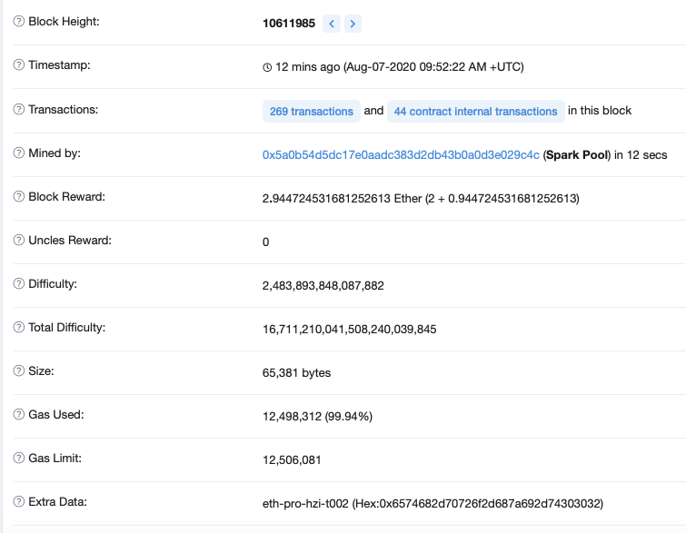

从详情里我们可以看到例如时间戳（Timestamp）、详细的区块链奖励数据（Block Reward与Uncles Reward）、Size、Gas Used、Gas Limit等额外数据。

这其中的概念都不算难理解，看不懂的也可以点击文字左边的问号，etherscan 提供了详细的解释。

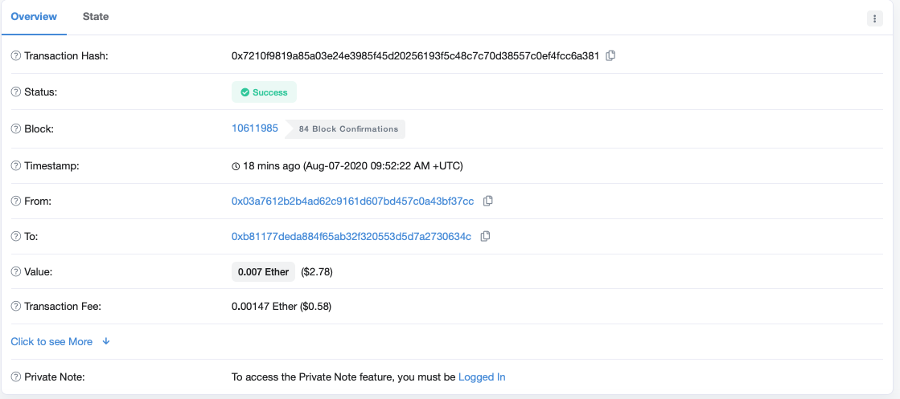

同样，对于 Transaction 这边，我们也可以去查看每笔交易详细的数据。

例如上图这笔交易，就显示了交易哈希、Status（Succes表示交易已确认成功）、所属的 Block 、转入地址和转出地址以及时间戳等信息。

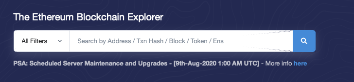

最后，如果我们想要查询具体的某交易、某区块、某地址的详细信息，也可以直接通过首页的搜索栏进行搜索。

## 基于以太坊发行的TOKEN

除了通过 etherscan 查询以太坊网络的当前数据外，查询基于以太坊发行的代币信息也是我们常用的功能。

在以太坊网络上发行的代币，主要是有两种，一种是ERC—20 Tokens，一种是ERC-721 Tokens。

ERC-20 Token 是同质化代币，与我们平时接触的比特币、莱特币这些一样，每一枚 Token 都一样，没有什么区别。

ERC-721 Token 则是非同质化代币（NFT），例如此前爆火的加密猫就是这类，他们的特点是每一个 Token 都是独一无二的。

下面我们就来通过 etherscan 看看目前以太坊网络上都有哪些ERC-20 Token与ERC-721 Token。

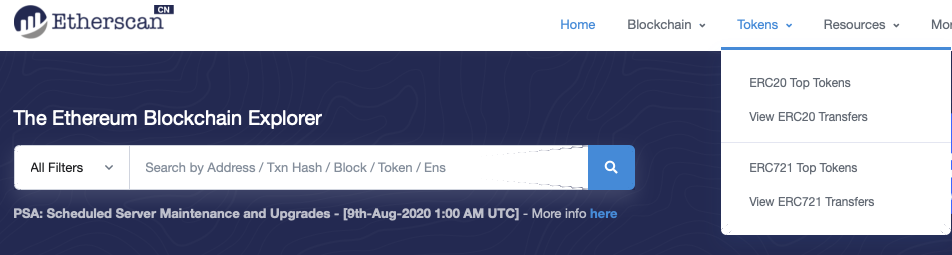

在首页我们点击 Tokens，就可以看到 ERC-20 与 ERC-721 ，我们以 ERC20 Top Tokens为例。

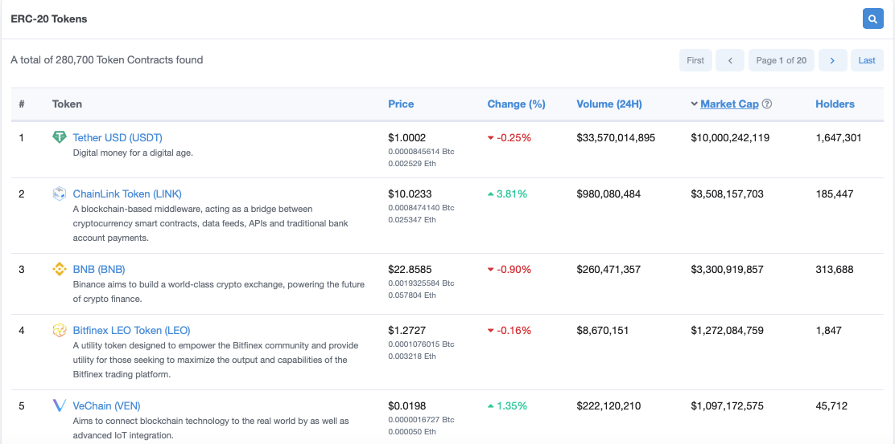

从排行里，相信大家看到了很多知名的代币，比如最近特别火爆的 LINK，再比如国人常用的 USDT ，还有币安发行的 BNB 。

然后点开某个 Token 后就可以看到这个 Token 当前的详情了，这里我们以 USDT 为例。

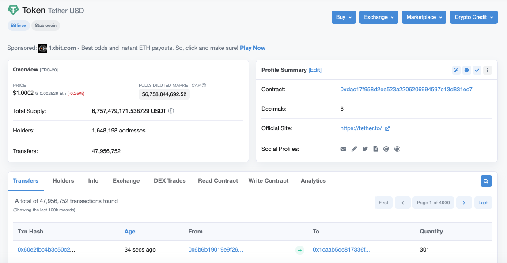

从页面里，我们可以看到基于以太坊发行的 usdt 的概览信息，例如当前的价格、市值、总发行量、持有者数量、部署的合约地址以及其官网等数据。

下方的几大功能区则可以方便我们查询 usdt 的交易数据、持有者数据、该智能合约提供的功能等信息。

## 查阅部署在以太坊上的合约

对于入门开发者来讲，etherscan 还是一个查阅、学习以太坊上合约的利器。

简单的，例如 Token 合约的查询，可以直接在 Token 的页面里，点击 Contract 后的合约地址就可以直接跳转到该 Token 的合约详情页面里。

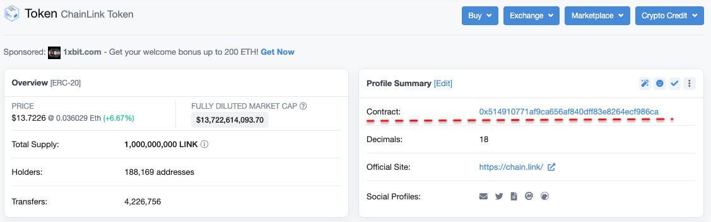

这里我们是以目前非常火爆的预言机项目 ChainLink 为例，进入合约详情页面后，我们可以看到该合约的基本信息，如部署者、交易信息等。

而在下方的 Contract 里，我们则是可以看到合约的名字、使用的 solidity 版本以及代码内容等，并且，点击 Read Contract ，我们还可以在线使用合约中的功能。

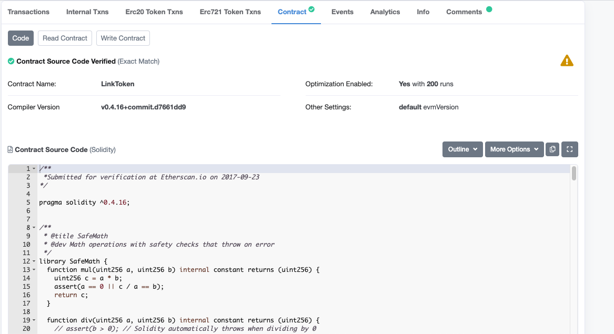

此外，在合约源码的下方，我们还可以查阅到该合约的 abi 。

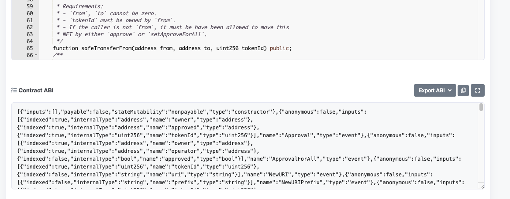

不过，Token 的合约内容基本都大相径庭，合约的内容主要是定义 Token 、实现转账功能、实现查询账户功能等常见的交易相关内容。

而如果我们想去查看更多、更多样复杂的合约，就需要我们手动搜素了。搜索的方式也非常的简单，在搜索框中输入合约地址即可查询到该合约的详情。

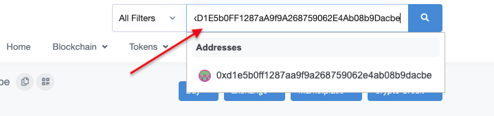

这里也为大家附上一些经典的合约的库地址，方便大家学习。

**预言机类：**
- ChainLink：

             https://github.com/smartcontractkit/chainlink(源码仓库)
             
             https://etherscan.io/address/0x514910771af9ca656af840dff83e8264ecf986ca#code
                
**稳定币类：**
- Dai：

       https://github.com/makerdao/dss(源码仓库)
       
       https://etherscan.io/address/0x6b175474e89094c44da98b954eedeac495271d0f#code
       
- USDT：

       https://etherscan.io/token/0xdac17f958d2ee523a2206206994597c13d831ec7
       
       (备注：该合约中对于最新合约版本的查询值得着重学习)

**NFT类：**
- CryptoKitties (加密猫):

        https://etherscan.io/address/0x06012c8cf97BEaD5deAe237070F9587f8E7A266d#code
        
- CryptoPunks (加密朋克):

        https://etherscan.io/address/0xb47e3cd837dDF8e4c57F05d70Ab865de6e193BBB#code
        
  (备注：该合约中的撤销部分值得着重学习)

**借贷类：**
- Compound：

         https://github.com/compound-finance/compound-protocol(源码仓库)
         
         https://etherscan.io/address/0xc00e94cb662c3520282e6f5717214004a7f26888#code

**博彩类Dapp：**
- Etheroll：

         https://etherscan.io/address/0xD91E45416bfbBEc6e2D1ae4aC83b788A21Acf583#code
         
  (备注：该合约中的预言机部分值得着重学习)

**DAO类：**
- The DAO:

          https://etherscan.io/address/0xBB9bc244D798123fDe783fCc1C72d3Bb8C189413#code

## 其他功能

最后，etherscan 还提供给了我们一些直观的可视化数据统计。

在 Charts & Statistics 页面里我们看到市值曲线、以太价格曲线、交易量曲线、地址数量曲线等等。

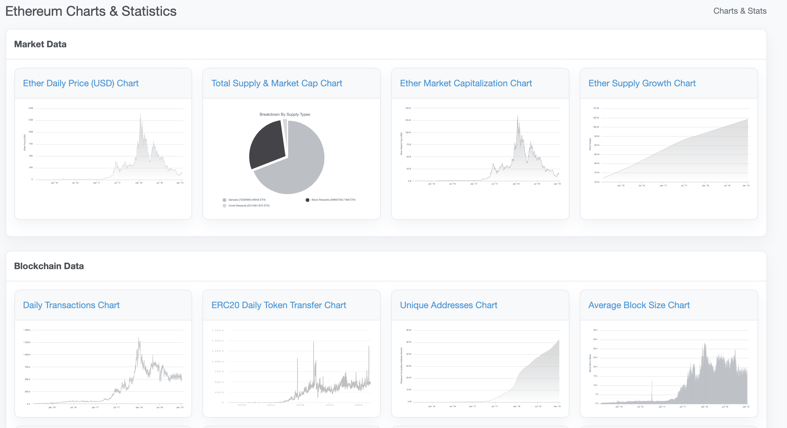

在 Top Statistics 里我们还可以看到不同的排行榜数据，比如矿工排名、Gas 使用排名等等。

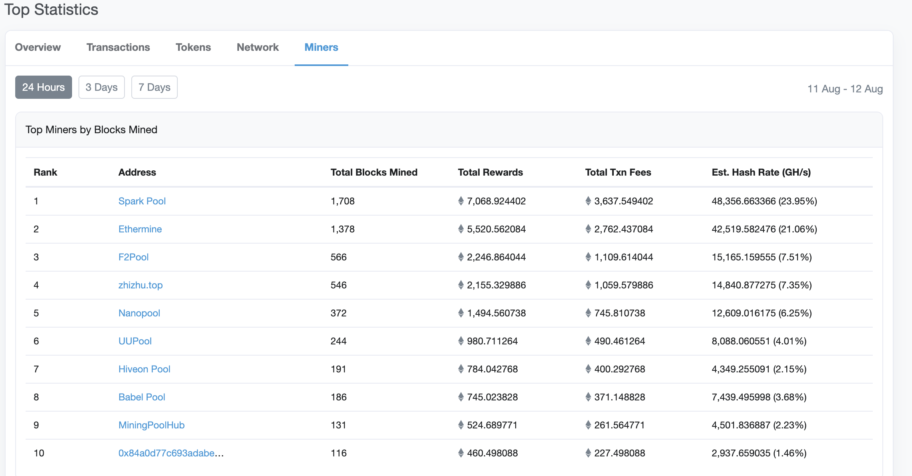

总体来说，通过 etherscan 这款工具，我们可以简单的了解到以太坊网络、基于其发行的代币以及合约的基本情况，其不仅是用户用于查询的利器，同时也是小白入门以太坊的最佳了解途径。

